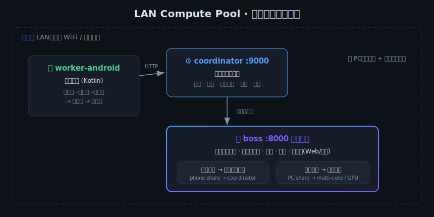

# LAN Compute Pool · 局域网算力共享池

> 把你身边的设备（**一台 PC + 若干安卓手机**）组成一个**局域网分布式算力池**，
> 按各设备算力**自动按比例分配**任务，加速**你自己的项目**（含**本地模型推理**）。
> 全程受**安全阈值**保护，带**算力租用计费**与**可视化界面**。
>
> **English** — Turn the devices around you (**one PC + several Android phones**) into a
> **LAN distributed compute pool** that **auto-splits work proportionally** to each device's
> capability, to accelerate **your own** projects (including **local-model inference**), guarded
> by **safety thresholds**, with **compute-rental billing** and **visual UIs**.

> ⚠️ **现实说明**：这是**你自己的**局域网算力池，加速**你自己的**项目。它**不能**把算力
> 贡献给 Claude / Anthropic 换取额度或优惠券——那种通道在现实中不存在。
> This is **your own** LAN pool for **your own** projects; it **cannot** earn Claude/Anthropic
> credits — no such channel exists.

---

## 一、三个组件 / Three components

> **版本 beta 0.2**（三端同步：协调端 / 安卓矿工 / Windows矿工 / 老板）。
> 新增**开发任务加速**(加速 PyCharm 重活)+ **能力路由** + **并行下载**。见下方第「十」节。

本仓库把原来三个独立项目**合并**到一起，它们协同工作：

| 目录 | 角色 | 技术 | 说明 |
|---|---|---|---|
| [`coordinator/`](coordinator/) | **协调端**（PC）| Python + Flask | 系统中枢：任务队列 + 设备心跳 + 安全阈值 + 计费 + 看板。手机/PC worker 都连它。|
| [`worker-android/`](worker-android/) | **安卓工人** | Kotlin + Compose | 手机当 worker，连协调端贡献算力。|
| [`boss/`](boss/) | **算力老板** | Python + Flask/Tkinter | 站在协调端之上做**项目级编排**：评估算力比例、按比例切分项目、调度 PC 全部关键硬件 + 手机、可视化。|

> 各组件还有**自己的详细 README**（点上面目录链接）；本页讲**怎么把三者部署到一起、在局域网里跑通**。

---

## 二、整体架构 / Architecture



```
        局域网 LAN (同一个 WiFi / 路由器)
 ┌────────────────────────────────────────────────────────────────────────┐
 │                                                                          │
 │   📱 安卓工人 (worker-android)          💻 PC                            │
 │   Kotlin app                            ┌─────────────────────────────┐  │
 │      │ HTTP 拉任务/交结果                │  协调端 coordinator  :9000   │  │
 │      └──────────────────────────────►   │  队列 + 心跳 + 阈值 + 计费    │  │
 │                                         └──────────────┬──────────────┘  │
 │                                            ▲           │ 提交"手机那份"   │
 │                                            │ 读状态     ▼                 │
 │                                         ┌─────────────────────────────┐  │
 │                                         │  算力老板 boss  :8000        │  │
 │                                         │  评估比例·切分·派发·合并·UI   │  │
 │                                         │  └─► PC 本地多核/GPU 引擎     │  │
 │                                         └─────────────────────────────┘  │
 └────────────────────────────────────────────────────────────────────────┘
```

- **协调端**是唯一对外监听的服务（:9000），手机和老板都连它。
- **老板**(:8000) 自己也跑在 PC 上：它读协调端状态、把"手机那一份"任务投进协调端队列、
  "电脑那一份"用本地多核/GPU 引擎自己算，最后合并。

---

## 三、详细部署 / Deployment (step by step)

### 0. 前置条件 / Prerequisites
- **一台 Windows PC**：装 **Python 3.8+**（勾选 “Add to PATH”）。
- **一台或多台安卓手机**（Android 5.0+ / API 21+）或安卓模拟器。
- **PC 和手机在同一个局域网**（连同一个 WiFi / 路由器）。
- 编译安卓 app 需 **Android Studio**（Giraffe+），或直接用已编好的 APK。

> 三个组件各自有独立的依赖，互不干扰；下面分别部署。

---

### A. 部署「协调端」(PC) / Deploy the Coordinator

协调端是中枢，**必须先启动**。

```bat
cd coordinator
:: 1) 建虚拟环境 + 装依赖
python -m venv .venv
.venv\Scripts\python -m pip install flask psutil
:: 2) 启动（一键脚本会先杀旧实例再启动，避免多实例抢 9000 端口）
启动协调端.bat
```

启动后：
- 监听 **`0.0.0.0:9000`**（局域网内都能连）。
- PC 浏览器开 **http://127.0.0.1:9000/dashboard** 看实时看板。
- 控制台会打印**本机局域网 IP**——手机就要连这个 IP。

> 没有 `启动协调端.bat` 时手动跑：`.venv\Scripts\python coordinator.py`
> 安全阈值/计费/API 细节见 [`coordinator/README.md`](coordinator/README.md) 与 [`coordinator/API.md`](coordinator/API.md)。

---

### B. 部署「安卓工人」(手机) / Deploy the Android Worker

**方式一：Android Studio 编译安装（推荐）**
1. Android Studio 打开 `worker-android/` 目录，等 Gradle 同步完成。
2. 手机用数据线连电脑并开 **USB 调试**（或用模拟器）。
3. 点 ▶ Run 把 app 装到手机/模拟器。

**方式二：直接装 APK**（若你已有编好的 APK）：把 APK 传到手机点击安装。

**配置服务器地址**（app 内「PC 协调端地址」输入框）：
- **真机（和 PC 同 WiFi）**：填 `http://<PC局域网IP>:9000`
  （PC 上 `ipconfig` 看 IPv4，例如 `http://192.168.1.20:9000`）。
- **安卓模拟器(AVD)**：填 `http://10.0.2.2:9000`
  （`10.0.2.2` 是模拟器访问宿主机 PC 的固定地址，**不是** 192.168.x）。

点「开始贡献算力」。此时协调端看板里应出现这台手机。
> 更多（安全阈值、任务类型、排错）见 [`worker-android/README.md`](worker-android/README.md) 与 [`worker-android/API.md`](worker-android/API.md)。

---

### C. 部署「算力老板」(PC) / Deploy the Boss

老板也跑在 PC 上，**在协调端之后启动**。

```bat
cd boss
:: 1) 建虚拟环境 + 装依赖
python -m venv .venv
.venv\Scripts\python -m pip install -r requirements.txt
:: 2) 两个界面二选一：
启动老板GUI.bat      :: Windows 桌面 GUI（原生窗口，推荐）
:: 或
启动老板.bat         :: Web 控制台 → 浏览器开 http://127.0.0.1:8000
```

打开界面后：
1. 点 **「重新评估算力」** → 出现 PC 与各手机的**算力比例条**。
2. 选**项目**、填参数 JSON，点 **「开始加速」**。
3. 实时看**每台设备的任务流**、进度、吞吐、结果。

> 老板默认连 `http://127.0.0.1:9000` 的协调端；如协调端在别的机器，改 `boss/boss_config.json`
> 的 `coordinator_url`。完整说明见 [`boss/README.md`](boss/README.md)。

---

## 四、局域网配置要点 / LAN setup essentials

### 1) 查 PC 的局域网 IP
PC 上开 `cmd` 跑 `ipconfig`，找 **IPv4 地址**（类似 `192.168.x.x`）。手机填的就是它。

### 2) 放行防火墙端口（关键，最常见的"连不上"原因）
首次启动时 Windows 防火墙可能拦截。允许 Python 通过防火墙，或手动放行端口：
```powershell
# 以管理员身份运行 PowerShell
New-NetFirewallRule -DisplayName "Coordinator 9000" -Direction Inbound -LocalPort 9000 -Protocol TCP -Action Allow
New-NetFirewallRule -DisplayName "Boss 8000"        -Direction Inbound -LocalPort 8000 -Protocol TCP -Action Allow
```

### 3) 端口一览 / Ports
| 服务 | 端口 | 监听 | 谁来连 |
|---|---|---|---|
| 协调端 Coordinator | **9000** | `0.0.0.0` | 手机 worker、算力老板 |
| 算力老板 Boss | **8000** | `0.0.0.0` | 浏览器（Web 控制台）|

### 4) 真机 vs 模拟器地址
| 设备 | 协调端地址 |
|---|---|
| 真机（同 WiFi）| `http://<PC局域网IP>:9000` |
| 安卓模拟器 AVD | `http://10.0.2.2:9000` |

### 5) 连通性自检
- 手机浏览器打开 `http://<PC局域网IP>:9000/dashboard`，能看到看板=网络通。
- 模拟器：`adb shell ping 10.0.2.2` 通=链路正常。

---

## 五、跑通一次完整流程 / End-to-end run

```
1. PC：启动协调端              coordinator/启动协调端.bat        (:9000)
2. 手机：开 app 填 PC 的 IP:9000 → 开始贡献算力   → 协调端看板出现这台手机
3. PC：启动老板                boss/启动老板GUI.bat              (:8000)
4. 老板界面：点「重新评估算力」 → 看到 PC:手机 的算力比例
5. 选项目(如"大区间素数统计") + 参数 → 点「开始加速」
6. 看每台设备任务流实时推进 → 出结果；手机掉线/RED 时老板自动 PC 兜底
```

**选哪个项目能看到手机一起干？** `prime_scan`(素数) / `hash_grind`(哈希) 手机原生支持；
`montecarlo`(估π) 目前仅 PC；`local_model`(本地模型) 手机承担等价 compute 重活。

---

## 六、安全阈值 / Safety thresholds
每台设备贡献前都先过阈值（GREEN 全速 / YELLOW 只接小任务 / RED 暂停）：
CPU、内存、磁盘、温度、电量、空闲内存、会话流量。手机额外重视**电池温度/电量**，
可开「仅充电时贡献」。阈值可在协调端 `safety.py` 或环境变量 `SAFE_*` 调整，
并会下发同步到手机。详见 [`coordinator/README.md`](coordinator/README.md)。

## 七、算力租用计费 / Billing
协调端按 CPU 核·秒 / 内存 MB·时 / 磁盘 MB·时 / 流量 MB / GPU·秒 五类单价累计
（记 `cc_billing.json`），可用于把你借出的算力折算成费用或抵租金。看板可见。

---

## 八、常见问题 / Troubleshooting

| 现象 | 原因 / 解决 |
|---|---|
| 手机连不上协调端 | ① 防火墙没放行 9000（见上）② 真机用 192.168.x，模拟器必须用 10.0.2.2 ③ 不在同一 WiFi |
| 时连时断 | **多个 coordinator 实例抢 9000 端口** → 永远用 `启动协调端.bat`（先杀旧实例）|
| 手机一直 RED 不接活 | 电量低 / 未充电（关「仅充电」）/ 内存紧张（小内存设备）。看 app 状态栏原因 |
| 手机一直“YELLOW 暂无” | 资源吃紧只接 small，而派的是 normal → 派任务带 `"weight":"small"` |
| 老板比例里没有手机 | 协调端没开 / 手机没在贡献 / 手机当时 RED。先确认看板里手机在线 |
| 老板 GUI 多进程报错 | 已用 `freeze_support()` + 模块零副作用规避；务必从 `.venv` 的 python 启动 |

---

## 九、仓库结构 / Layout
```
lan-compute-pool/
├─ coordinator/      协调端 (Python/Flask) —— 先启动，:9000
│  ├─ coordinator.py  safety.py  watchdog.py  test_worker.py
│  ├─ 启动协调端.bat   README.md  API.md
├─ worker-android/   安卓工人 (Kotlin/Compose) —— 手机端
│  ├─ app/src/main/java/com/example/cpu/{Worker,Safety,MainActivity}.kt
│  ├─ gradle/ gradlew settings.gradle  README.md  API.md
├─ boss/             算力老板 (Python) —— :8000，编排 + 可视化
│  ├─ boss.py(Web) boss_gui.py(桌面) scheduler.py capability.py …
│  ├─ templates/ static/  启动老板.bat 启动老板GUI.bat  README.md
└─ README.md         本文件（部署 + 局域网用法）
```

## 十、beta 0.2 新增：开发任务加速 / Dev Acceleration

老板端新增「🛠 开发任务加速」面板，把 PyCharm 里很慢/很吃算力的操作交给算力池：

| 任务 | 做什么 | 谁参与 |
|---|---|---|
| **并行计算** | 把计算型项目按算力比例分到 PC+手机 | PC + 手机 |
| **装库 (pip)** | 多包**并行下载**到共享 wheelhouse，再离线安装（重复装秒过）| PC 多进程（勾"网络"则手机帮下）|
| **装插件/下载** | 一批 URL **分发到池里并行下载**（贡献带宽）| PC + **手机** |
| **构建 APK** | Gradle **共享构建缓存 + 并行**，实时日志 | 仅 PC（有 SDK）|
| **一键部署真机** | `adb install -r` 到连接的真机 | PC + adb |
| **更新工人app** | adb 把最新 worker APK 推装到设备 | PC + adb |

**资源勾选**：界面可勾 ☑CPU ☑GPU(含手机) ☑内存 ☑硬盘(缓存) ☑网络(并行下载)，控制每个任务怎么用池子。

**诚实边界**：手机无 Android SDK/JDK，**不能编译 APK**；它能真正帮上忙的是**并行下载**(贡献带宽)与**并行计算**。构建/部署落在有 SDK 的 PC / adb 连接的真机上。

**三端同步 v0.2**：
- 协调端 `coordinator.py`：新增**能力路由**（任务 `requires` 只派给具备 `caps` 的设备）+ `/api/version`。
- 矿工（安卓 `Worker.kt` / Windows `test_worker.py`）：新增 `download` 并行预取任务 + 上报 `caps`(cpu/hash/download；手机 build=false) + 版本。
- 安卓 CPU 显示修复：旧版读全局 `/proc/stat` 被系统限制→永远 0%；改读**本进程 `/proc/self/stat`**(恒可读)，老板端/手机端都能看到"在忙"。

> ⚠️ 矿工连的是**协调端 :9000**（不是老板 :8000）。手机填 `http://<PC局域网IP>:9000`。
> 端口连不上多半是防火墙——见第「四」节放行 9000/8000。

## 许可 / License
本项目采用 **MIT License**（见 [LICENSE](LICENSE)）。原样提供，无担保。
Licensed under the **MIT License** (see [LICENSE](LICENSE)). Provided as-is, no warranty.
